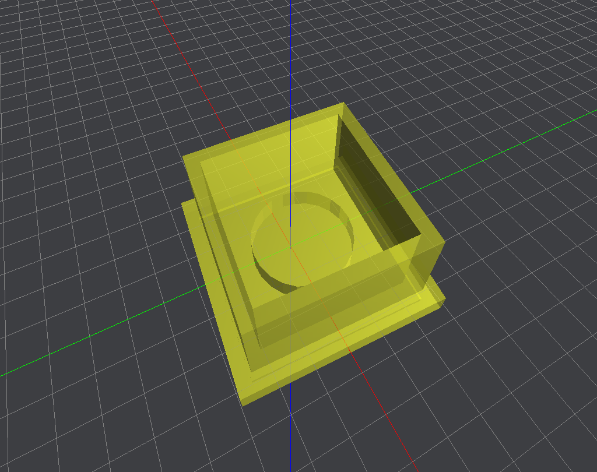

# Online 3D Viewer 
[Live Demo](https://rayhcc.github.io/3d-viewer/)  

## 專案功能
此專案為 Web 版的 3D 檢視器 App，使用者選擇欲檢視的 3D 模型後，可在 APP 對模型進行檢視與操作。

- 滑鼠操作(左鍵：旋轉 / 右鍵：平移 / 滾輪：遠近)
- 調整模型顏色、透明度
- 設定模型在座標系統的旋轉、平移、縮放
- 顯示 wireframe、格線、座標軸
    
    

## 使用的主要技術
- React
- RWD
- Three.js 繪圖函式庫